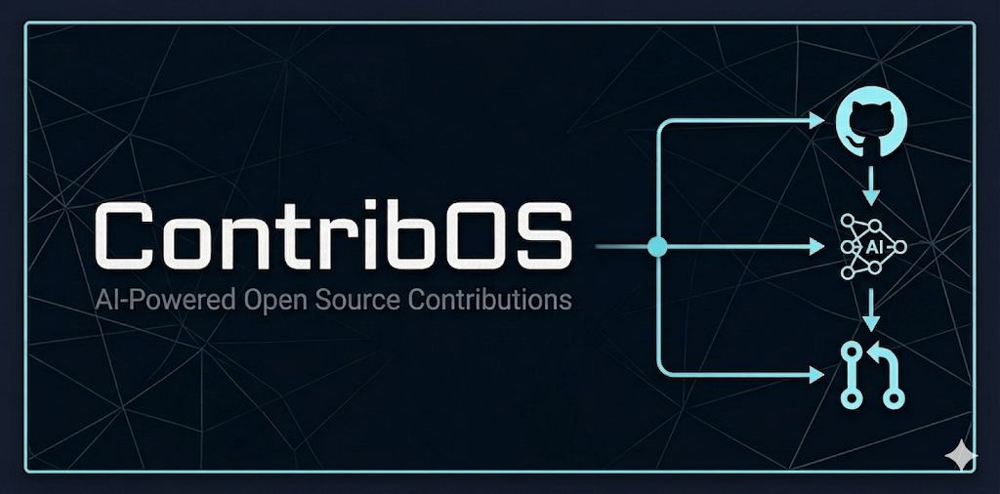

<p align="center">
  
</p>

<h1 align="center">ContribOS</h1>
<p align="center"><strong>Discover · Generate · Review · Submit</strong></p>
<p align="center"><em>AI-powered open-source contribution platform that turns GitHub issues into verified pull requests.</em></p>

<p align="center">
  <a href="#quick-start">Quick Start</a> ·
  <a href="#features">Features</a> ·
  <a href="#architecture">Architecture</a> ·
  <a href="CONTRIBUTING.md">Contributing</a> ·
  <a href="SECURITY.md">Security</a> ·
  <a href="CODE_OF_CONDUCT.md">Code of Conduct</a>
</p>

<p align="center">
  <a href="LICENSE"></a>
  <a href="https://github.com/aayushbaluni/contribos/actions"></a>
  <a href="https://github.com/aayushbaluni/contribos/releases"></a>
  = 22" />
  
  
  
  <a href="https://github.com/aayushbaluni/contribos/stargazers"></a>
</p>

---

## What is ContribOS?

ContribOS is a self-hostable platform that bridges the gap between **open-source projects with unfixed issues** and **developers who want to contribute**. It uses AI agents to analyze GitHub issues, generate code fixes as unified diffs, and walks contributors through a structured review process before submitting pull requests — all while building a verifiable reputation.

**The problem:** Contributing to open source is hard. Developers struggle to find good first issues, understand unfamiliar codebases, and produce quality patches. Maintainers are overwhelmed with low-quality PRs.

**The solution:** ContribOS automates the tedious parts — codebase analysis, fix generation, test validation — while keeping humans in the loop for quality control and learning. Contributors earn reputation through verified contributions, and maintainers receive higher-quality PRs with AI disclosure built in.

---

## Features

### For Contributors
- **Smart Issue Discovery** — AI-scored issue matching based on your skills, ecosystem preferences, and experience tier
- **AI Fix Generation** — Clone repos, analyze issues, generate unified diffs using 8+ LLM providers or custom models
- **Human-in-the-Loop Review** — Multi-step review gate with comprehension checks before PR submission
- **Reputation System** — Contribution Health Score (CHS) that tracks quality across ecosystems
- **Multi-Tier Progression** — Tier 1→4 system unlocking higher-prestige repositories
- **Credit-Based Usage** — Free tier with upgrade paths for power contributors

### For Platform Operators
- **Multi-Provider LLM Support** — Anthropic, OpenAI, Google, Mistral, Groq, DeepSeek, xAI, Perplexity
- **Bring Your Own Key (BYOK)** — Connect custom OpenAI-compatible endpoints
- **Agent-to-Agent Protocol (A2A)** — Delegate tasks to external AI agents via Google's A2A standard
- **Admin Dashboard** — Repository management, user oversight, prestige graph tuning, sync scheduling
- **GitHub Integration** — OAuth login, issue sync, automated PR creation with AI disclosure
- **Webhook Pipeline** — Real-time inbox for maintainer feedback on submitted PRs

### Technical Highlights
- **SSRF Protection** — Private IP validation on all external URL inputs
- **Encrypted Credentials** — AES-256-GCM encryption for stored API keys
- **Path Traversal Guards** — Sandboxed file reading in cloned repositories
- **Structured Logging** — Pino-based request-correlated logs
- **Content Security Policy** — Hardened nginx with CSP, HSTS-ready headers

---

## Architecture

```
┌─────────────────────────────────────────────────────────────────┐
│                        Browser (SPA)                            │
│              React 19 · Vite 6 · shadcn/ui · Zustand            │
└──────────────────────────┬──────────────────────────────────────┘
                           │ HTTP / WebSocket
┌──────────────────────────▼──────────────────────────────────────┐
│                      API Server                                  │
│           Fastify 5 · Prisma · BullMQ · GitHub OAuth             │
│                                                                  │
│  ┌──────────┐  ┌──────────┐  ┌───────────┐  ┌───────────────┐  │
│  │   Auth   │  │  Issues  │  │   Jobs    │  │   Providers   │  │
│  │  Guard   │  │ Matching │  │  Queue    │  │  (LLM/A2A)    │  │
│  └──────────┘  └──────────┘  └─────┬─────┘  └───────────────┘  │
└─────────┬───────────────────────────┼───────────────────────────┘
          │                           │
   ┌──────▼──────┐            ┌───────▼───────┐
   │ PostgreSQL  │            │ Agent Worker  │
   │  (Prisma)   │            │  Python 3.12  │
   │             │            │  FastAPI      │
   │  ┌───────┐  │            │               │
   │  │ Redis │  │            │ Clone → LLM   │
   │  │(Queue)│  │            │ → Diff → Test │
   │  └───────┘  │            └───────────────┘
   └─────────────┘
```

| Component | Stack | Responsibility |
|---|---|---|
| **`apps/web`** | React 19, Vite 6, TanStack Query, Zustand, shadcn/ui | SPA frontend — onboarding, matching, job status, review gate, admin |
| **`services/api`** | Fastify 5, Prisma, PostgreSQL, BullMQ, Redis | REST API — auth, business logic, job orchestration, GitHub integration |
| **`workers/agent-worker`** | Python 3.12, FastAPI, httpx | AI worker — repo cloning, LLM calls, diff generation, test execution |

---

## Quick Start

### Prerequisites

| Tool | Version | Purpose |
|---|---|---|
| [Node.js](https://nodejs.org/) | ≥ 22 | API and frontend runtime |
| [pnpm](https://pnpm.io/) | ≥ 9 | Package manager |
| [Docker](https://docs.docker.com/get-docker/) | Latest | Container runtime |
| [Docker Compose](https://docs.docker.com/compose/) | v2+ | Multi-service orchestration |

### 1. Clone and configure

```bash
git clone https://github.com/aayushbaluni/contribos.git
cd contribos
cp .env.example .env
```

Edit `.env` and set:
- **`GITHUB_CLIENT_ID`** and **`GITHUB_CLIENT_SECRET`** — from a [GitHub OAuth App](https://github.com/settings/developers)
- **`JWT_SECRET`** and **`JWT_REFRESH_SECRET`** — generate with `openssl rand -base64 48`
- **`ENCRYPTION_KEY`** — generate with `openssl rand -hex 32`
- At least one LLM key (e.g., `CLAUDE_API_KEY`, `OPENAI_API_KEY`)

### 2. Start the stack

```bash
docker compose up --build
```

This starts PostgreSQL, Redis, runs database migrations, and launches the API, worker, and web server.

### 3. Open the app

| Service | URL |
|---|---|
| Web UI | [http://localhost:3000](http://localhost:3000) |
| API | [http://localhost:3001](http://localhost:3001) |
| Worker | [http://localhost:8000](http://localhost:8000) |

Sign in with GitHub, complete onboarding, and start contributing.

---

## Development Setup

For local development without full Docker:

```bash
# Install dependencies
pnpm install

# Start databases only
docker compose up postgres redis -d

# Apply database schema
pnpm --filter @contribos/api db:push

# Run API and frontend
pnpm dev

# In another terminal — start the Python worker
cd workers/agent-worker
pip install -r requirements.txt
uvicorn src.main:app --reload --host 0.0.0.0 --port 8000
```

| Process | Default Port | Dev Command |
|---|---|---|
| Vite (frontend) | 5173 | `pnpm dev:web` |
| Fastify (API) | 3001 | `pnpm dev:api` |
| Uvicorn (worker) | 8000 | `uvicorn src.main:app --reload` |
| PostgreSQL | 5433 (host) | via Docker Compose |
| Redis | 6380 (host) | via Docker Compose |

---

## Environment Variables

All variables are documented in `.env.example` (Docker Compose), `services/api/.env.example` (local API), and `workers/agent-worker/.env.example` (local worker).

<details>
<summary><strong>Full variable reference (click to expand)</strong></summary>

| Variable | Required | Description |
|---|---|---|
| `GITHUB_CLIENT_ID` | Yes | GitHub OAuth App client ID |
| `GITHUB_CLIENT_SECRET` | Yes | GitHub OAuth App client secret |
| `GITHUB_CALLBACK_URL` | Yes | OAuth redirect URI (default: `http://localhost:3000/api/v1/auth/github/callback`) |
| `JWT_SECRET` | Yes | Access token signing key (≥ 32 chars) |
| `JWT_REFRESH_SECRET` | Yes | Refresh token signing key (≥ 32 chars) |
| `ENCRYPTION_KEY` | Yes | AES key for stored credentials (`openssl rand -hex 32`) |
| `S3_BUCKET` | Yes | Artifact storage bucket |
| `S3_REGION` | Yes | AWS region for the bucket |
| `DATABASE_URL` | Yes (API) | PostgreSQL connection string |
| `REDIS_URL` | Yes (API) | Redis URL for BullMQ |
| `CLAUDE_API_KEY` | One LLM key required | Anthropic API key |
| `OPENAI_API_KEY` | One LLM key required | OpenAI API key |
| `GOOGLE_AI_API_KEY` | One LLM key required | Google AI API key |
| `MISTRAL_API_KEY` | Optional | Mistral API key |
| `GROQ_API_KEY` | Optional | Groq API key |
| `DEEPSEEK_API_KEY` | Optional | DeepSeek API key |
| `XAI_API_KEY` | Optional | xAI API key |
| `PERPLEXITY_API_KEY` | Optional | Perplexity API key |
| `GITHUB_PAT` | Optional | GitHub PAT for issue sync (repo:read scope) |
| `WORKER_URL` | Optional | API → Worker URL (default: `http://worker:8000`) |
| `WORKER_SERVICE_TOKEN` | Recommended | Shared API ↔ Worker auth token (required in production) |
| `GITHUB_WEBHOOK_SECRET` | Optional | Secret for verifying GitHub webhook payloads |
| `CALLBACK_URL` | Optional | API URL the worker calls back to (default: `http://api:3001`) |
| `WORKER_ID` | Optional | Worker instance identifier (default: `agent-worker-1`) |
| `MAX_EXECUTION_TIME` | Optional | Max job execution time in seconds (default: `600`) |
| `CORS_ORIGIN` | Optional | Allowed browser origin (default: `http://localhost:3000`) |
| `NODE_ENV` | Optional | `development` / `production` |

</details>

---

## Tech Stack

| Layer | Technologies |
|---|---|
| **Frontend** | React 19, Vite 6, TypeScript, shadcn/ui, Radix UI, TanStack Query, Zustand, Tailwind CSS |
| **Backend** | Fastify 5, TypeScript, Prisma ORM, PostgreSQL, BullMQ, Redis, Zod |
| **Worker** | Python 3.12, FastAPI, httpx, Pydantic, Anthropic SDK |
| **Auth** | GitHub OAuth 2.0, JWT (access + refresh), httpOnly cookies |
| **AI/ML** | Multi-provider LLM (8 providers), BYOK, A2A protocol (JSON-RPC 2.0) |
| **DevOps** | Docker, Docker Compose, GitHub Actions CI, pnpm workspaces |
| **Testing** | Vitest, pytest, ESLint |
| **Security** | Helmet, CORS, rate limiting, SSRF protection, AES-256-GCM encryption, CSP |

---

## Project Structure

```
contribos/
├── .github/
│   ├── workflows/ci.yml            # CI pipeline (lint, test, build)
│   ├── ISSUE_TEMPLATE/             # Bug report & feature request forms
│   └── PULL_REQUEST_TEMPLATE.md    # PR checklist
├── apps/
│   └── web/                        # React SPA
│       ├── src/
│       │   ├── components/         # Shared UI components (shadcn/ui)
│       │   ├── features/           # Feature modules (dashboard, jobs, review, ...)
│       │   ├── hooks/              # Custom React hooks
│       │   ├── lib/                # API client, utilities
│       │   └── stores/             # Zustand stores
│       ├── nginx.conf              # Production reverse proxy config
│       └── Dockerfile
├── services/
│   └── api/                        # Fastify API server
│       ├── src/
│       │   ├── common/             # Guards, middleware, config, errors
│       │   ├── modules/            # Feature modules (auth, ai, jobs, ...)
│       │   └── lib/                # Infrastructure (queue, worker, redis)
│       ├── prisma/
│       │   └── schema.prisma       # Database schema
│       └── Dockerfile
├── workers/
│   └── agent-worker/               # Python AI worker
│       ├── src/
│       │   ├── providers/          # LLM provider adapters
│       │   ├── executor.py         # Job execution engine
│       │   ├── a2a_adapter.py      # A2A protocol client
│       │   └── main.py             # FastAPI entrypoint
│       └── Dockerfile
├── docs/                           # Documentation and assets
├── docker-compose.yml              # Full-stack orchestration
├── .env.example                    # Environment template
├── .gitignore                      # Git ignore rules
├── CODE_OF_CONDUCT.md              # Contributor Covenant v2.1
├── CONTRIBUTING.md                 # Contribution guidelines
├── SECURITY.md                     # Security policy
├── CHANGELOG.md                    # Release history
└── LICENSE                         # MIT License
```

---

## How It Works

```
1. Discover        2. Claim          3. Generate       4. Review         5. Submit
┌──────────┐    ┌──────────┐    ┌──────────┐    ┌──────────┐    ┌──────────┐
│  Browse  │───▶│  Claim   │───▶│  AI Agent │───▶│  Review  │───▶│  Create  │
│  Issues  │    │  Issue   │    │ Generates │    │  Gate    │    │    PR    │
│          │    │          │    │   Diff    │    │          │    │          │
└──────────┘    └──────────┘    └──────────┘    └──────────┘    └──────────┘
   Smart            Credit         Multi-LLM      Comprehension    GitHub PR
   Matching         Deducted       + A2A           Check            + Disclosure
```

1. **Discover** — AI-scored issues matched to your skills and tier
2. **Claim** — Reserve an issue (1 credit per run)
3. **Generate** — The agent clones the repo, analyzes the issue, calls your chosen LLM, and produces a unified diff
4. **Review** — Walk through a multi-step review gate with the generated diff
5. **Submit** — Approved fixes become GitHub PRs with AI disclosure

---

## Contributing

We welcome contributions of all kinds. Please read our [Contributing Guide](CONTRIBUTING.md) for details on:

- Setting up the development environment
- Branch naming and commit conventions
- Pull request process
- Code style and testing requirements

---

## Community

- [GitHub Discussions](https://github.com/aayushbaluni/contribos/discussions) — Ask questions, share ideas, show your contributions
- [Issue Tracker](https://github.com/aayushbaluni/contribos/issues) — Report bugs or request features
- [Code of Conduct](CODE_OF_CONDUCT.md) — Our commitment to a welcoming community

### Good First Issues

Looking to contribute? Check out issues labeled [`good first issue`](https://github.com/aayushbaluni/contribos/labels/good%20first%20issue) — they're specifically curated for new contributors.

---

## Star History

If ContribOS helps you contribute to open source, consider giving it a star. It helps others discover the project.

<p align="center">
  <a href="https://star-history.com/#aayushbaluni/contribos&Date">
    
  </a>
</p>

---

## Security

If you discover a security vulnerability, please follow our [Security Policy](SECURITY.md). Do **not** open a public issue for security reports.

---

## License

ContribOS is released under the [MIT License](LICENSE).

Copyright (c) 2025-present ContribOS Contributors
